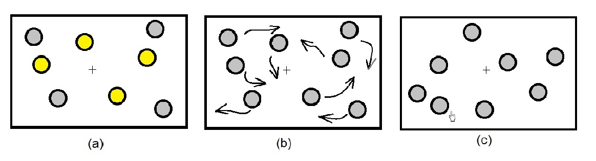

# MOT/MIT Experiment

## Experiment description

This experiment comprises of two interweaving parts: Multiple Object Tracking (MOT) and Multiple Item Tracking (MIT). Objects are indefferentiable targets, such as two identical circles. The image below represents a typical sequence of events in a MOT task: target objects are initially highlighted before becoming identical to the distractor. When the objects stop moving few random objects are highlighted again. The challenge is to identify which of them were the targets.

By <a href="//commons.wikimedia.org/w/index.php?title=User:Teeeea&amp;action=edit&amp;redlink=1" class="new" title="User:Teeeea (page does not exist)">Teeeea</a> - Own work, <a href="https://creativecommons.org/licenses/by-sa/4.0" title="Creative Commons Attribution-Share Alike 4.0">CC BY-SA 4.0</a>, <a href="https://commons.wikimedia.org/w/index.php?curid=79518465">Link</a>

The MIT part differs from MOT in that displayed objects are easily differentiable, e.g. a star and a circle. The participant's task is to determine if highlighted objects were targets and which shapes were highlighted.

## Configuration

In the repo's main catalogue there's a `config.py` file. It serves as a configuration file for the entire experiment.

### Variables' units

- Unit for time variables, such as `cue_time` is a second.
- Unit for size variables, such as `response_circle_radius` **are not pixels**. This program uses normalized units, precisely a percent of the screen's height. The resulting size is calculated as such: `size * scale`, e.g. `0.05 * 1080 = 54px`. More about units: [Psychopy Docs](https://www.psychopy.org/general/units.html#units)
- Colors are generally represented as color strings, e.g. `red` or `blue`. For complete list of available color names look for `colorNames` dictionary in [Psychopy's Color source code](https://www.psychopy.org/_modules/psychopy/colors.html#Color)

### Most important configuration variables

Generally most of the configuration variables **shouldn't be changed**. There are three variables that toogle specific experiment parts -- **these you should change** if need be. E.g. you could disable eyetracker with `eyetracker_on = False` for some quick test or to prevent errors when running the experiment without the connected eyetracker. These variables are:

| Variable Name | Description | Default Value |
| :--- | :--- | :--- |
| `training_on` | Boolean flag to enable or disable the training phase. | `False` |
| `eyetracker_on` | Boolean flag to enable or disable the eye-tracking system. **It must be enabled in the real experiment**. | `True` |
| `form_on` | Boolean flag to enable or disable the user form (to collect user data before the experiment starts). **It must be enabled in the real experiment**. | `False` |

### Complete configuration variables list

| Variable Name | Description | Default Value |
| :--- | :--- | :--- |
| `participants_path` | Path to the directory where participant data will be saved (relative to repository root location). | `"data/participants"` |
| `fieldnames` | Column headers for the output data file (e.g., CSV). | Default configuration is available in #output-file-format |
| `scale` | Screen resolution or a scaling factor (e.g., vertical resolution in pixels). | `1080` |
| `target_color` | Color used for the primary target object(s). | `"blue"` |
| `mirror_color` | Color used for the mirror (object in the mirror position to the target but on a non-target side) object(s). | `"yellow"` |
| `response_circle_radius` | Radius (in normalized units) of the area for a response selection. | `0.1` |
| `response_circle_target_color` | Color of the response circle for the **target** selection. | `"green"` |
| `response_circle_mirror_color` | Color of the response circle for the **non-target** (mirror) selection. | `"red"` |
| `feedback_color` | Color used for providing textual feedback to the participant. | `"black"` |
| `feedback_font_size` | Font size (in normalized units) for feedback text. | `0.05` |
| `orbit_radius` | Radius of the circular path objects orbit around the center (e.g., for targets). | `0.06` |
| `images_orbit_radius` | Radius of the circular path images orbit around the center (for MIT). | `0.08` |
| `image_radius` | Radius (size) of the individual images/stimuli. | `0.08` |
| `image_cover_radius` | Radius of the cover/mask placed over the images/stimuli. | `0.05` |
| `image_highlight_radius` | Radius used to highlight an image/stimulus when cued. | `0.07` |
| `orbiting_speed` | Angular speed of the orbiting objects, in radians per second. | `$3/2 * π` |
| `cue_time` | Duration (in seconds) the initial cue/highlight is presented. | `1.5` |
| `probe_time` | Duration (in seconds) the probe or tracking phase lasts. | `1.5` |
| `mot_target_color` | Target color specific to the **Multiple Object Tracking (MOT)** task. | `"blue"` |
| `mit_target_color` | Target color specific to the **Multiple Identity Tracking (MIT)** task. | `"magenta"` |
| `max_response_time_mot` | Maximum time allowed (in seconds) for a response in the **MOT** task. | `2.5` |
| `max_response_time_mit` | Maximum time allowed (in seconds) for a response in the **MIT** task. | `5.0` |
| `training_on` | Boolean flag to enable or disable the training phase. **It must be enabled in the real experiment**. | `False` |
| `eyetracker_on` | Boolean flag to enable or disable the eye-tracking system. **It must be enabled in the real experiment**. | `True` |
| `form_on` | Boolean flag to enable or disable the user form (to collect user data before the experiment starts). **It must be enabled in the real experiment**. | `False` |

---
