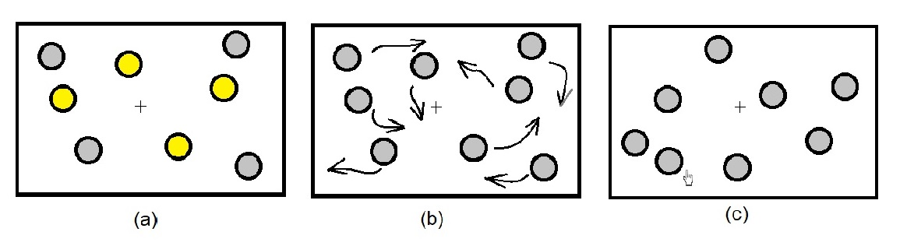

# MOT/MIT Experiment

## Experiment description

This experiment comprises of two interweaving parts: Multiple Object Tracking (MOT) and Multiple Item Tracking (MIT). Objects are indefferentiable targets, such as two identical circles. The image below represents a typical sequence of events in a MOT task: target objects are initially highlighted before becoming identical to the distractor. When the objects stop moving few random objects are highlighted again. The challenge is to identify which of them were the targets.

By <a href="//commons.wikimedia.org/w/index.php?title=User:Teeeea&amp;action=edit&amp;redlink=1" class="new" title="User:Teeeea (page does not exist)">Teeeea</a> - Own work, <a href="https://creativecommons.org/licenses/by-sa/4.0" title="Creative Commons Attribution-Share Alike 4.0">CC BY-SA 4.0</a>, <a href="https://commons.wikimedia.org/w/index.php?curid=79518465">Link</a>

The MIT part differs from MOT in that displayed objects are easily differentiable, e.g. a star and a circle. The participant's task is to determine if highlighted objects were targets and which shapes were highlighted.

## Configuration

In the repo's main catalogue there's a `config.py` file. It serves as a configuration file for the entire experiment.

### Variables' units

- Unit for time variables, such as `cue_time` is a second.
- All size variables (e.g. `response_circle_radius`) are defined directly in **pixels (px)**. This ensures consistent stimulus size regardless of the scaling settings, provided the PsychoPy window is set to `units='pix'`.  ~~Unit for size variables, such as `response_circle_radius` **are not pixels. This program uses normalized units, precisely a percent of the screen's height. The resulting size is calculated as such: `size * scale`, e.g. `0.05 * 1080 = 54px`.~~ More about units: [Psychopy Docs](https://www.psychopy.org/general/units.html#units)
- Colors are generally represented as color strings, e.g. `red` or `blue`. For complete list of available color names look for `colorNames` dictionary in [Psychopy's Color source code](https://www.psychopy.org/_modules/psychopy/colors.html#Color)

### Most important configuration variables

Generally most of the configuration variables **shouldn't be changed**. There are three variables that toogle specific experiment parts -- **these you should change** if need be. E.g. you could disable eyetracker with `eyetracker_on = False` for some quick test or to prevent errors when running the experiment without the connected eyetracker. These variables are:

| Variable Name | Description | Default Value |
| :--- | :--- | :--- |
| `training_on` | Boolean flag to enable or disable the training phase. | `False` |
| `eyetracker_on` | Boolean flag to enable or disable the eye-tracking system. **It must be enabled in the real experiment**. | `True` |
| `form_on` | Boolean flag to enable or disable the user form (to collect user data before the experiment starts). **It must be enabled in the real experiment**. | `False` |

### Complete configuration variables list

| Variable Name | Description | Default Value |
| :--- | :--- | :--- |
| `experiment_name` | Name used for data logging and eye-tracking sessions. | `"MOT_MIT_EEG"` |
| `participants_path` | Directory path for saving output CSV files. | `"data/participants"` |
| `fieldnames` | List of headers for the output data file. | *(See Table 2 (CSV file structure))* |
| `scale` | General scaling factor for the experiment view. | `1` |
| `target_color` | Color for primary target objects. | `"blue"` |
| `mirror_color` | Color for mirror objects (non-targets on opposite side). | `"yellow"` |
| `response_circle_radius` | Radius of the selection area in **pixels**. | `108` |
| `response_circle_target_color`| Color of the selection indicator for targets. | `"green"` |
| `response_circle_mirror_color`| Color of the selection indicator for non-targets. | `"red"` |
| `feedback_color` | Color of the on-screen feedback text. | `"black"` |
| `feedback_font_size` | Size of the feedback text in **pixels**. | `54` |
| `orbit_radius` | Object movement path radius in **pixels**. | `64.8` |
| `images_orbit_radius` | Radius for MIT image placement in **pixels**. | `86.4` |
| `image_radius` | Size of individual stimuli in **pixels**. | `86.4` |
| `image_cover_radius` | Radius of the stimulus mask in **pixels**. | `54` |
| `image_highlight_radius` | Radius of the cue/highlight effect in **pixels**. | `75.6` |
| `orbiting_speed` | Angular speed in radians per second. | $1.5 \times \pi$ ($270^\circ/s$) |
| `cue_time` | Duration of initial target highlight (s). | `1.5` |
| `probe_time` | Duration of the probe/tracking phase (s). | `1.5` |
| `mot_target_color` | Target color specific to MOT task. | `"blue"` |
| `mit_target_color` | Target color specific to MIT task. | `"magenta"` |
| `max_response_time_mot` | Timeout for MOT response (s). | `2.5` |
| `max_response_time_mit` | Timeout for MIT response (s). | `5.0` |
| `n_blocks` | Total number of blocks in the experiment. | `4` |
| `n_selected_combinations` | Trials per block (`None` = include all). | `None` |
| `training_on` | Toggle for practice phase. **It must be enabled in the real experiment**. | `False` |
| `eyetracker_on` | Toggle for eye-tracking system. **It must be enabled in the real experiment**. | `False` |
| `form_on` | Toggle for participant demographic form. **It must be enabled in the real experiment**. | `True` |
---

## CSV file structure

| Column| Description| Example|
| :--- | :--- | :--- |
| **UserID** | Unique user identifier (hash). | `476323ff` |
| **Age / Sex / Handedness** | Demographic data: age, sex, lateralisation. | `21, m, r` |
| **Trial Number** | Trial number in block | `9` |
| **Block number** | Block number in entire experiment | `1` |
| **Trial Type** | Task type: **MOT** (tracking identical objects) lub **MIT** (tracking unique objects). | `MOT` |
| **Target Set Size** | Number of objects to track (the higher this number, the harder the task). | `2` |
| **Target Side** | On which side of the screen the targets for tracking are displayed (**L**eft / **R**ight). | `R` |
| **Layout** | Objects' layout on the screen (e.g. top-bottom, all). | `Layout.TOP_BOT` |
| **Highlighted Target** | True if in this trial one of the targets was highlighted, False otherwise. | `False` |
| **Response** | Type of the user's response (target/distractor (MOT) or image path (MIT). N/A if no response.| `target` |
| **Response Time** | Time from probe onset to user click in seconds (value `-1.000` means no reaction/timeout). | `2.172` |
| **Status** | Trial status. `completed`: completed trial, `interrupted`: interrupted by eyetracker, `escaped`: exited by `Esc` key, `completed_recovery`: trial completed in `interrupted` block. | `unknown` |
| **Correct Response** | What is the correct response. | `distractor` |
| **Correctness** | Was user's response correct: `1` (correct), `0` (incorrect). | `0` |
| **TrialID** | Unique trial ID (hash) | `fdc017b6` |
| **ConditionID** | Trial parameters encoded into a numeric string. Mapping: TrialType (MOT:0, MIT:1), Side (L:0, R:1), SetSize (2:0, 3:1), Layout (specific: 0-3)| `0103` |
| **Images** | List of images selected for the trial. A single file for MOT. | `11a.png\|11b.png\|9a.png\|9b.png\|5a.png\|5b.png` |
| **Targets** | Logic identifiers of target objects. Format: Orb:[ID] (orbit index) and Tidx:[ID] (item index within orbit). | `Orb:3_Tidx:1` |
| **Clicked_Orbit_ID** | Index of the orbit with the object selected by user. | `2` |
| **Clicked_Item_Idx** | Index of the item selected by the user inside the orbit. | `1` |
| **Probe_Orbit_ID** | Index of the orbit with the highlighted item. | `1` |
| **Probe_Item_Idx** | Index of the highlighted item inside the orbit. | `0` |
